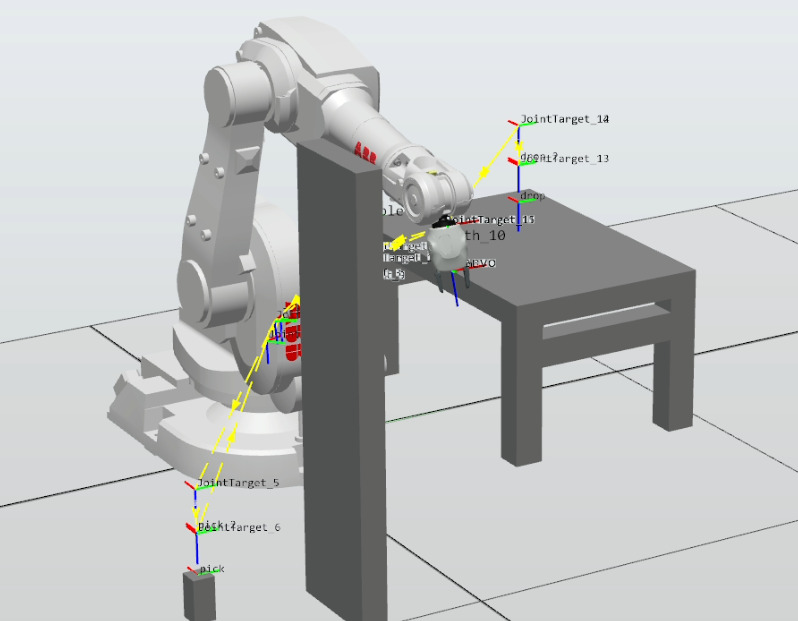
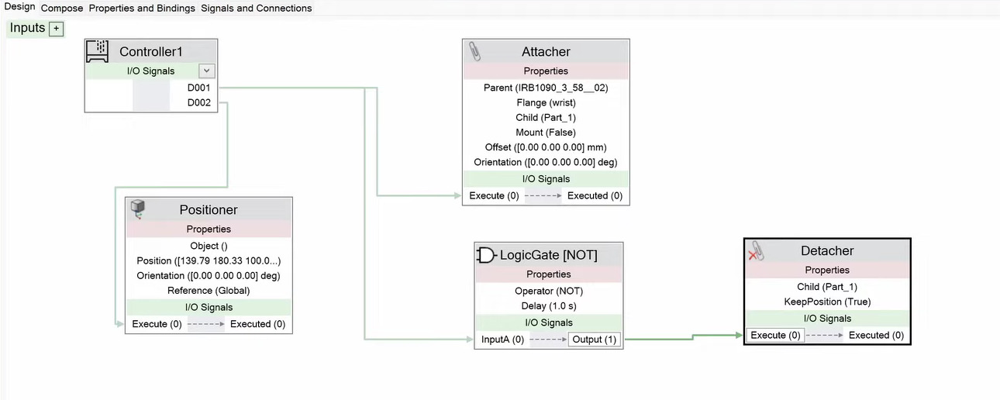

# ABB IRB 1600 – Pick and Place Simulation (RobotStudio)

This project showcases an ABB IRB 1600 industrial robotic arm performing an automated **pick-and-place operation** in RobotStudio.  
The robot picks a box from a source location and places it onto a table while maintaining **collision-free motion**, ensuring it does not touch any walls or surrounding objects.

---

## 🎥 Demo Video  
Click the image below to watch the full simulation:

---

## 📌 Features
- Complete **pick-and-place cycle** using ABB IRB 1600  
- Smooth and **collision-free** robot path planning  
- Custom RobotStudio station with accurate object placements  
- Executed using **ABB RAPID** motion instructions (MoveL, MoveJ, etc.)  
- Demonstrates safe industrial robot operation principles  

---

## 🖥️ Station Logic
The image below represents the station logic used for the robot’s operation flow:

---

## 🛠 Tools & Technologies
- **ABB RobotStudio**
- **IRB 1600 Manipulator**
- **RAPID Programming**
- **3D Station Design**
- **Collision Detection**

---

## 📧 Contact
If you’d like help building similar simulations or automating industrial robots, feel free to reach out!
